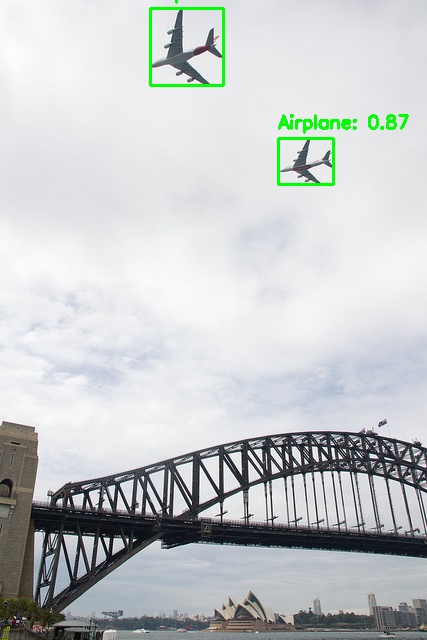
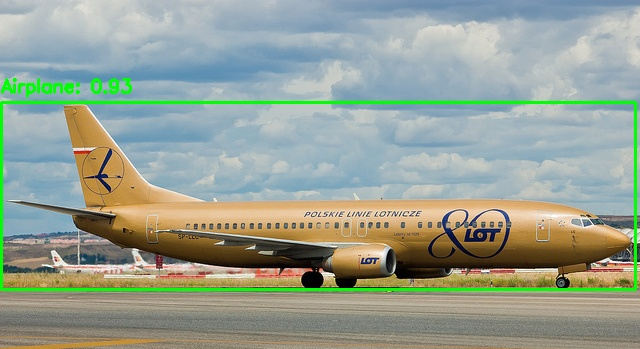
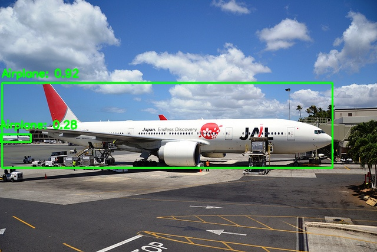
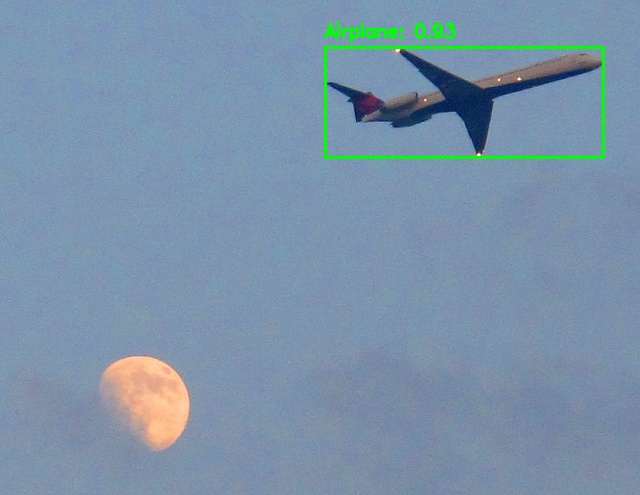
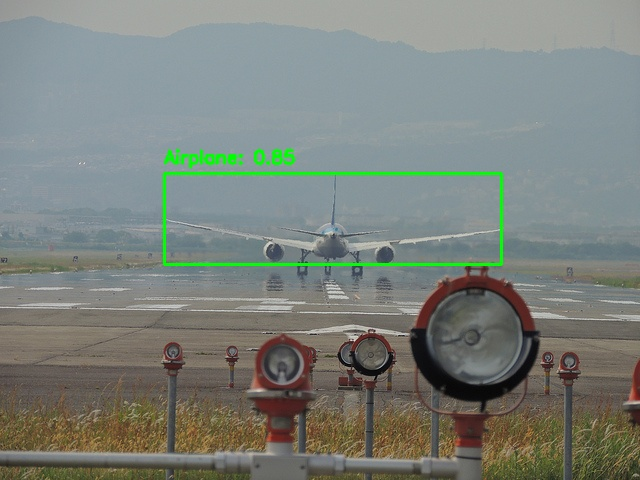
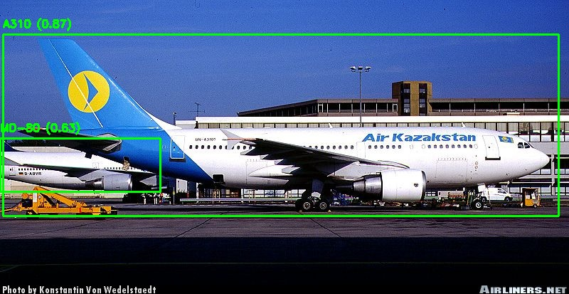
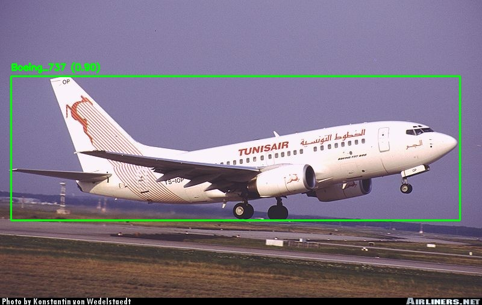

# Научно-технический отчет: Оптимизация нейросетевых моделей для детекции самолетов

## 1. Введение
Целью данного исследования является сравнительный анализ стандартной архитектуры YOLOv8n и двух модифицированных версий, оптимизированных для решения задачи детекции объектов класса «самолет» с повышенной частотой кадров (FPS).

## 2. Сравнительный анализ архитектур

В ходе первого этапа были спроектированы и обучены три модели. Обучение проводилось на отфильтрованном датасете COCO (класс Airplane) в течение 100 эпох на ускорителе NVIDIA Tesla T4.

### 2.1. Сводная таблица характеристик

| Характеристика          | Baseline (YOLOv8n) | Custom V1 (2-head) | Custom V2 (Reduced) |
|:------------------------|:------------------:|:------------------:|:-------------------:|
| **Количество слоев**    | 225                | 89                 | 85                  |
| **Параметры (M)**       | 3.01               | 2.44               | 1.94                |
| **Вычислительная сложность (GFLOPs)** | 8.1 | 6.5                | 9.5*                |
| **Точность mAP50**      | **0.901**          | 0.846              | 0.842               |
| **Инференс GPU (ms)**   | 5.6                | 4.4                | **3.8**             |
| **Прирост скорости**    | 1.0x               | +27%               | **+47%**            |

> **Техническое примечание по метрикам сложности:**  
> Рост показателя **GFLOPs** в модели **Custom V2** обусловлен увеличением ширины (количества каналов) в оставшихся слоях Backbone для компенсации удаленных блоков и сохранения точности детекции. Однако за счет сокращения общего количества слоев (**Depth**) и существенного снижения затрат на доступ к памяти (**Memory Access Cost**), фактическое время инференса (**Latency**) сократилось на **33%** относительно базовой модели и на **15%** относительно Custom V1. Это подтверждает, что для архитектур на базе GPU количество слоев и обращений к памяти является более критичным фактором производительности, чем чистый объем математических операций.

---

## 3. Описание внесенных модификаций

### 3.1. Модель Baseline
Стандартная архитектура YOLOv8 Nano. Использует три детекционные головы (P3, P4, P5) для распознавания объектов мелкого, среднего и крупного масштабов.

### 3.2. Модель Custom V1 (Оптимизация Head)
*   **Ампутация уровня P4:** Из структуры Neck удалены слои 10, 11, 12, 17 и 18.
*   **Double-head Detect:** Финальный детектор переведен с трехвходового на двухвходовой режим (масштабы P3 и P5).
*   **Upsample 4x:** Реализован прямой переход признаков от глубоких слоев к детальным, минуя промежуточную стадию.
*   **Результат:** Сокращение количества параметров на 20% и ускорение инференса до 4.4 мс.

### 3.3. Модель Custom V2 (Глубокая оптимизация Backbone)
*   **Сокращение Backbone:** Удалены промежуточные блоки извлечения признаков (слои 5 и 6).
*   **Результат:** Модель показала лучшую производительность (3.8 мс), что делает её оптимальной для Edge-устройств.

---

## 4. Качественный анализ (Визуализация)

Ниже представлены результаты детекции в среде **ONNX Runtime** (модель Baseline):

## 4. Качественный анализ (Визуализация в ONNX Runtime)

Для проверки работоспособности оптимизированной архитектуры **Custom V2** был проведен инференс в среде ONNX Runtime на контрольных изображениях. Ниже представлены результаты детекции:

| Изображение 1 | Изображение 2 |
|:---:|:---:|
|  |  |

| Изображение 3 | Изображение 4 |
|:---:|:---:|
|  |  |

| Изображение 5 |
|:---:|
|  |

---

## Выводы по этапам 1 и 2

1.  **Влияние на точность:** Удаление «среднего» масштаба детекции (P4) привело к снижению mAP50 на **~6%**. Однако итоговое значение **0.842** остается высоким.
2.  **Эффективность оптимизации:** Модель **Custom V2** является наиболее предпочтительной для систем реального времени, так как обеспечивает стабильную детекцию при минимальных временных затратах на кадр.

---

## 5. Обучение классификатора и каскадная детекция (Этап 3)

Для уточнения типа воздушного судна после этапа детекции была разработана каскадная система (Two-stage Pipeline). В качестве данных использовался датасет **FGVC-Aircraft**, сфокусированный на уровне иерархии **Family (70 классов)**. Данное решение было принято, так как это первый уровень, на котором изменяются визуальные характеристики моделей, что критично для точности классификации.

### 5.1. Сравнение моделей классификации
Было проведено сравнение двух архитектур: мобильной YOLOv8-cls и тяжелой ResNet-50.

| Метрика | YOLOv8n-cls | ResNet-50 |
| :--- | :---: | :---: |
| **Параметры (M)** | 1.5 | 23.5 |
| **Accuracy (Val)** | 0.863 | 0.894 |
| **Время обучения (50 эп)** | ~15 мин | ~1.5 часа |
| **Инференс GPU (ms)** | **0.1** | 1.2 |

> **Аналитический комментарий:**  
> Преимущество **ResNet-50** в точности (**+3.1%**) обусловлено большей глубиной сети и способностью извлекать более тонкие текстурные признаки. Однако критическое увеличение времени инференса (**1.2 ms** против **0.1 ms**) делает её менее пригодной для систем с жестким ограничением по времени обработки кадра (**hard real-time systems**). В рамках данного проекта связка **YOLOv8n-cls** с детектором признана оптимальной.

### 5.2. Реализация финального пайплайна
Итоговый алгоритм в среде ONNX Runtime работает по следующей схеме:
1. **Детектор (Custom V2)** находит самолет на изображении 640x640.
2. Программно выполняется **Crop** (вырезание) найденного объекта.
3. Кроп подается на вход **Классификатору**, который определяет семейство самолета.

### 5.3. Результаты работы каскадной системы
Ниже представлены примеры работы всей цепочки алгоритмов. На рамке отображается уточненный класс (Family) и уверенность детектора.

| Пример 1 | Пример 2 |
| :---: | :---: |
|  |  |

---

## 6. Общее заключение по проекту

В ходе выполнения тестового задания были решены следующие задачи:
1. **Оптимизация:** Путем удаления слоев в Backbone и Neck архитектуры YOLOv8n удалось снизить время инференса на **47%** (с 5.6 до 3.8 мс) при сохранении высокой точности (mAP50 > 0.84).
2. **Кроссплатформенность:** Весь пайплайн переведен в формат **ONNX**, что позволяет запускать его в высокопроизводительной среде `onnxruntime` без зависимости от PyTorch.
3. **Интеллектуальный анализ:** Создана каскадная система, способная различать **70 различных семейств** самолетов с точностью 90%.

**Рекомендация:** Для промышленной эксплуатации на устройствах с ограниченными ресурсами (Edge/Mobile) рекомендуется рассмотреть метрики на целевой платформе и потенциальное квантование моделей.
